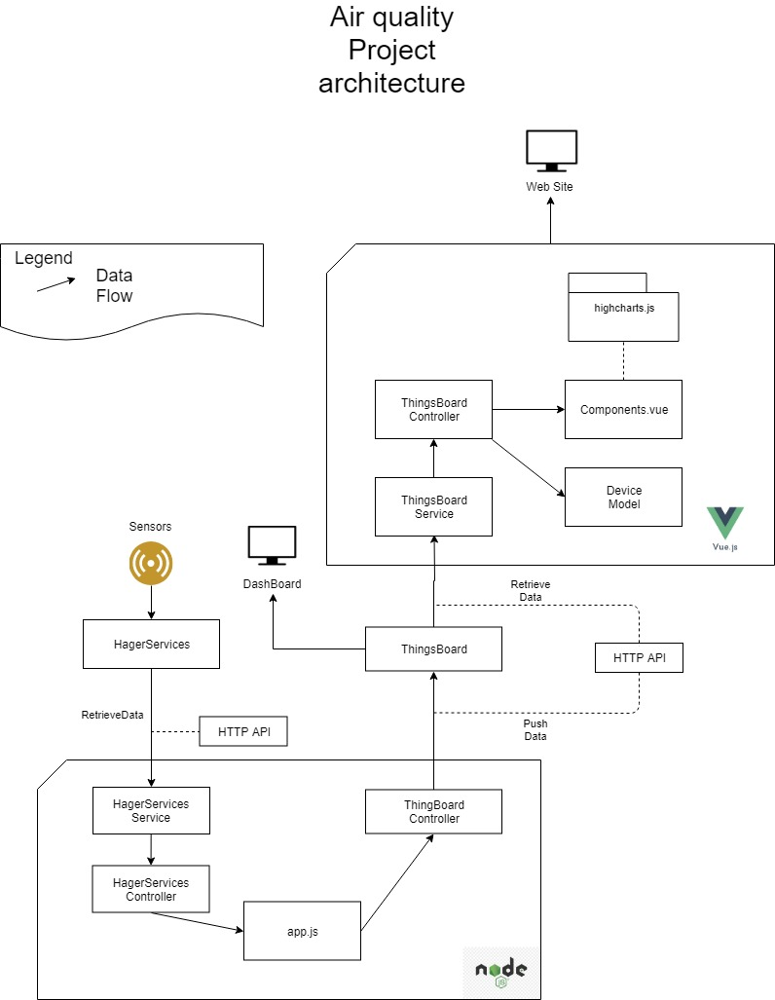

# Connector

This connector is used to retrieve data from the Hager Service plateform to the local Thingsboard of the Nimbus.

## Description
**Language :** Node.js
**Dependencies :** npm + [package.json](package.json)
 
## Data Structure
You can find below the architecture of the project in the bottom part of this diagram. 

The Programme is divided in 3 parts: Model, Service, Controller.

### Service

#### Hager Service
The service retrieves data from APIs. The folder `service/hagerServiceService` regroup 3 files:

##### [hagerServiceService.js](service/hagerServiceService/hagerServiceService.js)
A collection of the function returning the different raw data from the api using the custom axios service. 

##### [http.js](service/hagerServiceService/http.js)
A custom axios service to call the Hager Service API.

A first call is required to retrieve a token.
All the calls to the API require the [Basic Authentification](https://en.wikipedia.org/wiki/Basic_access_authentication)
 as `Basic Base64(username:password)`. Where username and password are the HagerService Plateform credentials for the
  login route. For all the other routes, the username is the token response retrieved from the login call and the
   password is empty.    

##### [routes.jon](service/hagerServiceService/routes.json)
A json file where the routes to the hagerService API.
#### ThingsBoard
Same principle than the previous service but used to connect to Thingsboard. The Authentication is a bit different,
 please refer to the official documentation.

### Controller

Used to call the service and process some logic.
 